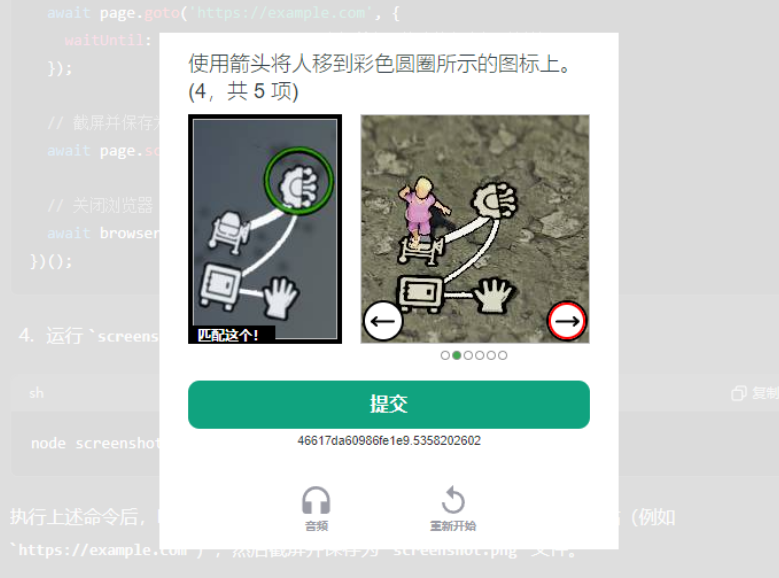
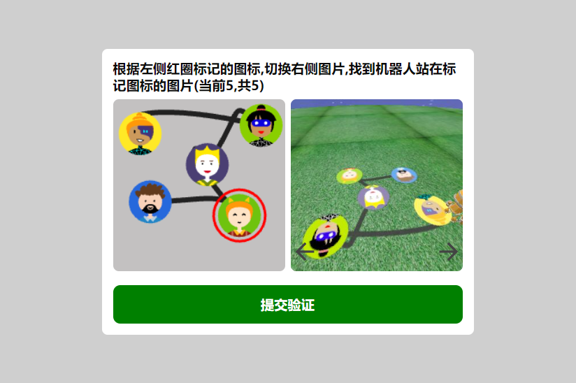

<p align="center">
  
  
</p>


# chatgpt-captcha3d


https://github.com/simple16000148819/chatgpt-captcha3d/assets/58202305/74325bd2-7c3f-480d-a698-4f7e97a90c28

近期使用ChatGPT频繁出现图形验证码真的很烦躁!!!    
but这个图形验证码挺有意思的(你从未见过的全新版本)   
那就借助GPT自己高仿一下验证码组件吧!


## 实现思路

1.选用nuxt3进行全栈开发   
2.canvas绘制随机图标路径贴图   
3.threejs绘制3d场景转为图片   
4.后端使用puppeteer调用headless浏览器打开渲染页进行渲染   
5.puppeteer监控渲染页面log读取渲染结果返回给api   

## 使用的第三方库
```bash
# 生成唯一标识
npm i uuid

# 随机生成唯一的svg头像图标
npm i @multiavatar/multiavatar

# threejs渲染3D场景
npm i three

# 后端控制无头浏览器渲染页面
npm i puppeteer

```

## 项目运行调试

```bash
#克隆项目
git clone https://github.com/simple16000148819/chatgpt-captcha3d
cd chatgpt-captcha3d
npm i
npm run dev

```
生成地面贴图 [captcha-texture.vue](./components/captcha-texture.vue)  
渲染3D场景图 [scene-render.vue](./components/scene-render.vue)  
验证码组件 [scene-render.vue](./components/captcha-modal.vue)  
后端api生成验证码 [gen.ts](./server/api/gen.ts)  
后端api校验验证码 [auth.ts](./server/api/auth.ts)  

[验证码组件演示:](http://localhost:3000)  [index.vue](./pages/index.vue)  
[渲染页](http://localhost:3000/render)  [render.vue](./pages/render.vue)  


## 联系我
